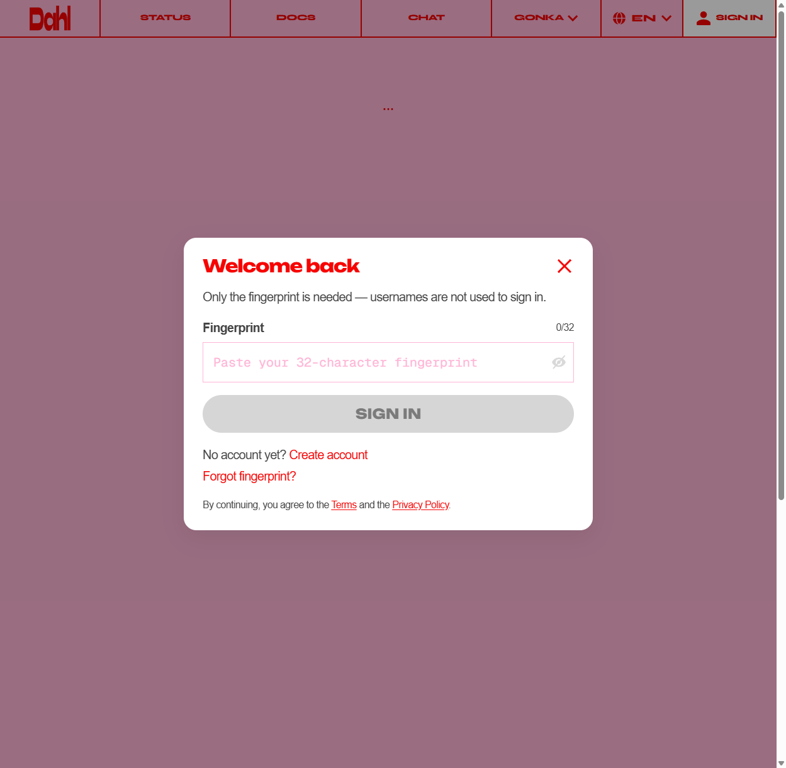
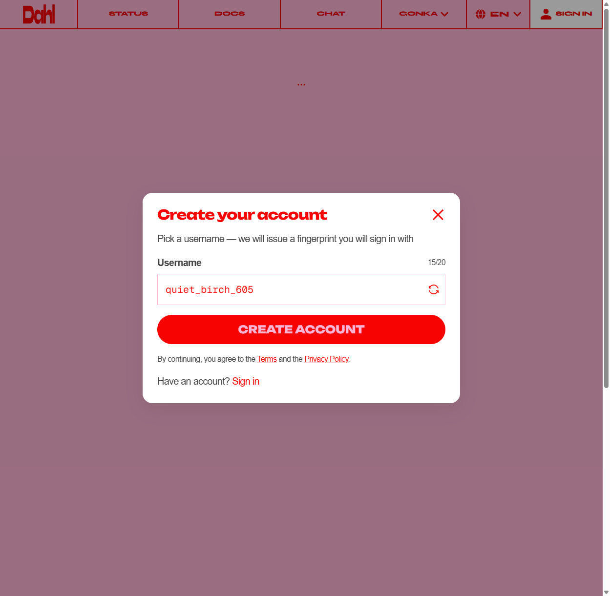
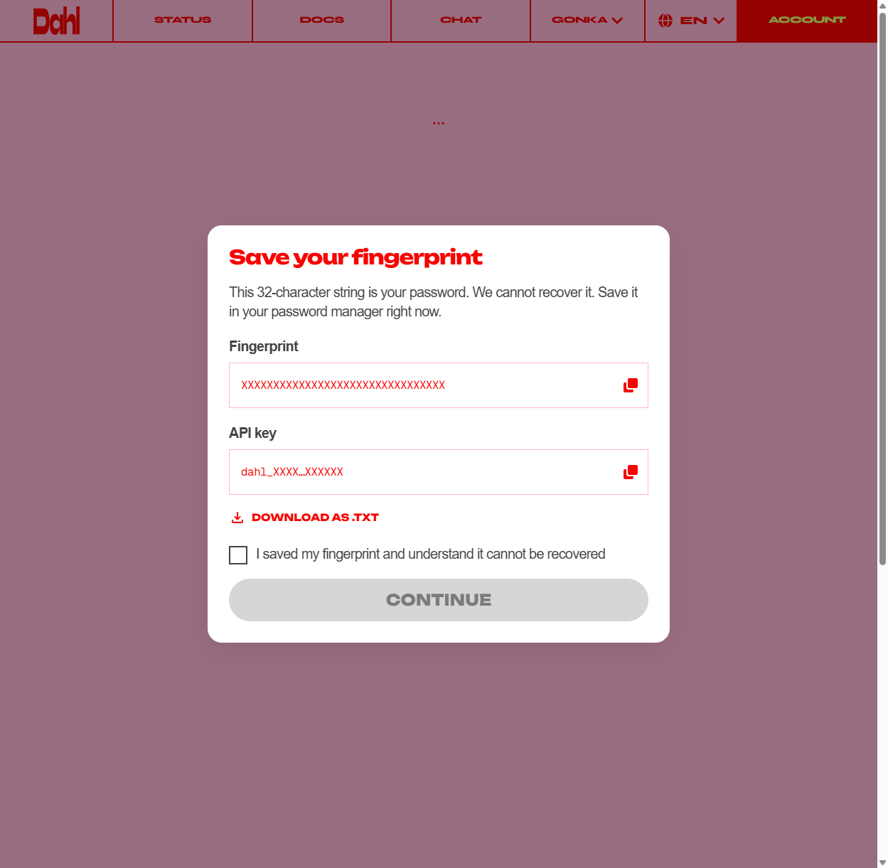
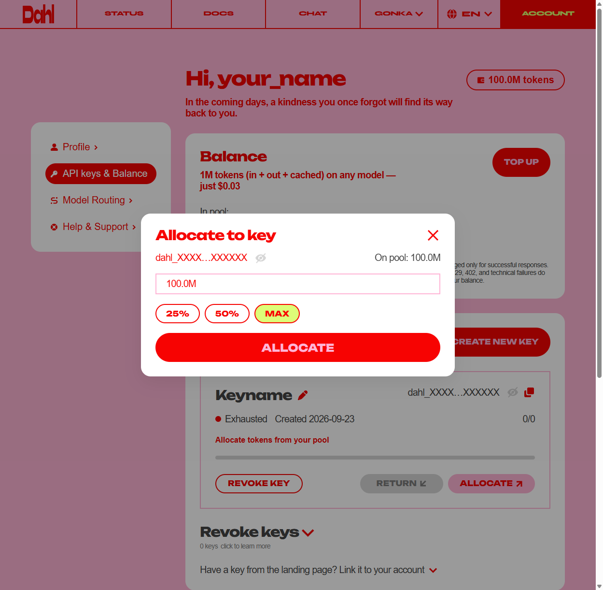
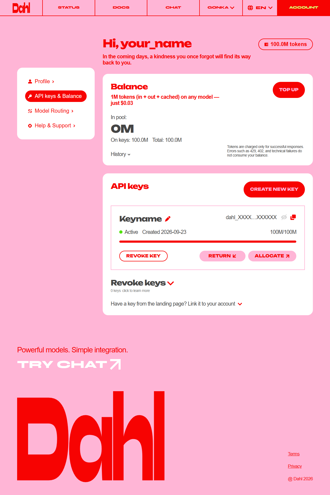

# Ключ Dahl за 2 минуты (100 млн токенов бесплатно)

Сайт: https://inference.dahl.global/account

Логина и пароля у Dahl нет. Вместо пароля сайт выдаёт **fingerprint**, строку из
32 символов. Потеряете его, и в аккаунт больше не войти, восстановить нельзя. Ключ
при этом продолжит работать.

## 1. Создайте аккаунт

Откройте ссылку. Появится окно «Welcome back» — внизу нажмите **Create account**.

Имя можно оставить, какое предложили, оно ни на что не влияет. Нажмите
**Create account**.

## 2. Сохраните fingerprint и скопируйте ключ

Появится окно **Save your fingerprint**. В нём сразу два значения:

- **Fingerprint**: ваш пароль. Нажмите **Download as .txt** или скопируйте его в
  заметки.
- **API key**: начинается с `dahl_`. Это ключ для установщика. Нажмите значок
  копирования справа.

Поставьте галочку «I saved my fingerprint…» и нажмите **Continue**.

## 3. Нажмите Allocate, иначе ключ пустой

Все 100 млн токенов после регистрации лежат в общем «пуле», а на самом ключе
**0**, статус **Exhausted**. С таким ключом Hermes не ответит.

В разделе **API keys** у ключа нажмите **Allocate** → **Max** → **Allocate**.

Готово, если у ключа статус **Active** и **100M/100M**:

## 4. Вставьте ключ в установщик

В установщике выберите **Dahl** и вставьте API key (`dahl_…`).

---

Проверено 23.09.2026: новый аккаунт, Allocate, запрос к модели
`MiniMaxAI/MiniMax-M2.7` вернул ответ (HTTP 200). Сайт может поменяться. Если
кнопки называются иначе, ищите по смыслу: «создать аккаунт», «сохранить»,
«выделить токены на ключ».
